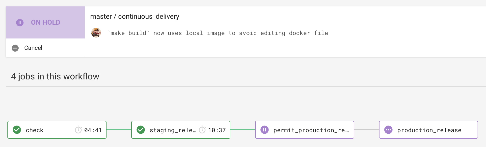

# LBH Income API

The Income API is the backend of the [Income Collection Service][github-ics], and connects to the legacy Universal Housing database and the [Tenancy API][github-tenancy-api].

It is used to store users, prioritise cases, assign cases evenly to users, and retrieve information about those cases.

## Stack

- Rails as a web framework.
- Puma as a web server.
- Delayed Job for running background and scheduled tasks.

## Development practices

We employ a variant of Clean Architecture, borrowing from [Made Tech Flavoured Clean Architecture][mt-ca].

## Contributing

### Setup

1. Install [Docker][docker-download].
2. Get a hackney aws account (see maintainers)
3. Clone this repository.
4. Login to ecr [Universal Housing Simulator][github-uh-simulator]:
```bash
$ aws configure
$ aws ecr get-login --no-include-email --region $AWS_DEFAULT_REGION | sh
```
5. Run setup
```bash
make setup
```

### Development

#### Serving the app locally

To serve the application, run the following and visit [http://localhost:3000](http://localhost:3000).

```sh
$ make serve
```

#### Testing

To run linting and tests:

```sh
$ make check
```

If you're TDDing code, it can sometimes be faster to boot up the app container once, then run tests within it. That way you don't have to start the Docker container every time you run tests:

```sh
# in a separate tab, run this to get a shell within the Docker container
$ make shell

# run rspec after every change in the Docker container shell
$ rspec

# or for one file
$ rspec path/to/spec
```

The above is useful because you can TDD your change and manually test through the browser without having to restart anything.

#### Linting

"Linters" run static analysis on code to ensure it meets style standards. We use [Rubocop][rubocop] on this project with a permissive configuration.

```
$ make lint
```

You can use the following to ensure your changes are deployable, in that they are passing the automated test suite and have no code style issues.

```
$ make check
```

### Release



We use a pull request workflow, where changes are made on a branch and approved by one or more other maintainers before the developer can merge into `master`.

Then we have an automated four step deployment process, which runs in CircleCI.

1. Automated tests (RSpec) and linting (Rubocop) are run to ensure the release is of good quality.
2. The app is deployed to staging automatically, where we check our latest changes work well.
3. We manually confirm a production deployment in the CircleCI workflow once we're happy with our changes in staging.
4. The app is deployed to production.

### Connection to Universal Housing

Universal Housing configuration is given through environment variables, for example using development details:

- UH_DATABASE_NAME=StubUH
- UH_DATABASE_USERNAME=sa
- UH_DATABASE_PASSWORD=Rooty-Tooty
- UH_DATABASE_HOST=universal_housing
- UH_DATABASE_PORT=1433

We use a [Universal Housing simulator][github-uh-simulator] to run automated tests against, mirroring the structure of the legacy Universal Housing database.


## Cloud Storage and KMS (Key Management System)

The letters generated (PDF files) will be saved in S3 using Client-Side Encryption with Aws KMS.

The Cloud Storage solution make use of the following ENV variables:

- AWS_ACCESS_KEY_ID
- AWS_REGION
- AWS_SECRET_ACCESS_KEY
- CUSTOMER_MANAGED_KEY

Those keys need to be different for staging and production enviroments.

In addition, 2 different users(or roles) are needed to manage the Customer Managed Key:
- A user with permissions to manage the keys
- A user with permissions to use the keys (to encrypt/decrypt document)

For more: [AWS Client Side encryption] https://docs.aws.amazon.com/AmazonS3/latest/dev/UsingClientSideEncryption.html

## Contacts

### Active Maintainers

- **Rashmi Shetty**, Development Manager at London Borough of Hackney (rashmi.shetty@hackney.gov.uk)
- **Vlad Atamanyuk**, Junior Developer at London Borough of Hackney (vladyslav.atamanyuk@hackney.gov.uk)
- **Mark Rosel**, Lead Engineer at [Made Tech][made-tech] (mark.rosel@madetech.com)
- **Steven Leighton**, Engineer at [Made Tech][made-tech] (steven@madetech.com)
- **Cormac Brady**, Engineer at [Made Tech][made-tech] (cormac@madetech.com)
- **Elena Vilimaitė**, Engineer at [Made Tech][made-tech] (elena@madetech.com)

### Other Contacts

- **Jeff Pinkham**, Engineer at [Made Tech][made-tech] (jeff@madetech.com)
- **Richard Foster**, Lead Engineer at [Made Tech][made-tech] (richard@madetech.com)
- **Luke Morton**, Director at [Made Tech][made-tech] (luke@madetech.com)
- **Dennis Robinson**, Delivery Lead at London Borough of Hackney (dennis.robinson@hackney.gov.uk)
- **Soraya Clarke**, Delivery Manager at London Borough of Hackney (soraya.clarke@hackney.gov.uk)

[github-uh-simulator]: https://github.com/LBHackney-IT/lbh-universal-housing-simulator
[github-ics]: https://github.com/LBHackney-IT/LBH-IncomeCollection
[github-tenancy-api]: https://github.com/LBHackney-IT/LBHTenancyAPI
[docker-download]: https://www.docker.com/products/docker-desktop
[mt-ca]: https://github.com/madetech/clean-architecture
[made-tech]: https://madetech.com/
[rubocop]: https://github.com/rubocop-hq/rubocop
